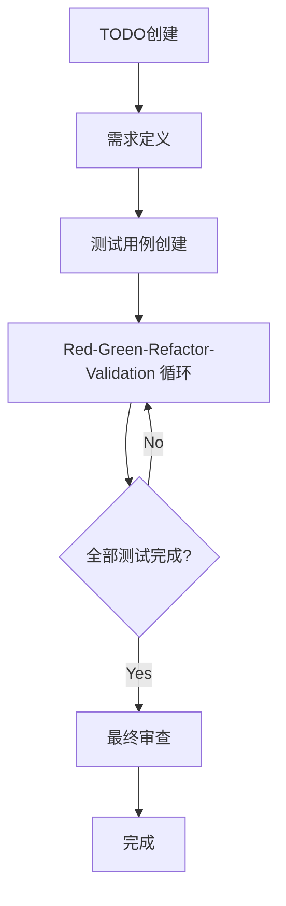

# 3.1 扩展TDD流程概览

## AITDD流程概述

AITDD是将传统的TDD(测试驱动开发)与AI的力量相结合,并增加了**Validation**步骤的扩展开发方法。通过人类与AI的协作,可以高效地开发高质量的软件。

## 整体流程结构



### 基本流程

```
TODO创建 → 需求定义 → 测试用例创建 → Red-Green-Refactor-Validation → 最终审查
```

## 各步骤详解

### 1. TODO创建(由人工负责)

**目的**: 明确定义开发任务,并将其分解为适当的工作单元

**工作内容**:
- 梳理功能需求
- 细分开发任务
- 设置优先级
- 明确工作范围

**交付物**: TODO.md文件
- 具体且可实施的任务列表
- 各任务的优先级和依赖关系
- 完成条件的定义

### 2. 需求定义(由人工负责·必须审查)

**目的**: 从TODO制定详细的技术规范

**工作内容**:
- 定义功能的详细规格
- 明确输入输出
- 制定错误处理方针
- 设定性能要求

**重要要点**:
- **必须由人工审查**
- 参考AI的建议,但最终判断由人工做出
- 消除规格的模糊性

**交付物**: requirements.md文件
- 功能需求的详细说明
- 技术约束
- 质量要求

### 3. 测试用例创建(由人工负责·必须审查)

**目的**: 基于规格设计全面的测试用例

**工作内容**:
- 设计正常流程测试用例
- 设计异常流程测试用例
- 规划边界值测试
- 识别边缘用例

**重要要点**:
- **必须由人工审查**
- 确保测试用例的覆盖性
- 验证与规格的一致性

**交付物**: testcases.md文件
- 测试用例列表
- 期望行为的详细说明
- 测试数据的定义

### 4. Red-Green-Refactor-Validation循环(主要由AI负责)

扩展了传统的TDD循环,增加了**Validation**步骤。这个循环几乎全部由AI执行,但在人工监督下进行。

#### Red(测试失败)
- 实现测试用例
- 确认预期的失败
- 执行测试并确认失败

#### Green(最小实现)
- 使测试通过的最小实现
- AI自动代码生成
- 确认测试成功

#### Refactor(重构)
- 改善代码质量
- AI优化
- 提高可读性和可维护性

#### Validation(验证)
- 验证实现的合理性
- 质量检查
- 确认额外的验证项目

### 5. 最终审查(由人工负责)

**目的**: 最终确认生成代码的整体质量和规格符合性

**工作内容**:
- 源代码的详细审查
- 确认与规格的一致性
- 安全检查
- 性能验证

**重要要点**:
- **必须由人工实施**
- 最终保证AI生成代码的质量
- 投入生产环境前的最后防线

## AI与人类的角色分工

### AI(Claude等)负责的领域

- **Red-Green-Refactor-Validation循环的执行**
  - 测试用例的实现
  - 生产代码的生成
  - 重构的执行
  - 质量验证的支持

- **代码生成和优化**
  - 高效算法的实现
  - 遵循编码规范的实现
  - 自动代码改进

- **自动测试执行**
  - 测试的执行和结果确认
  - 测试覆盖率的测量
  - 持续的质量检查

### 人类负责的领域

- **战略决策**
  - 需求定义和审查
  - 测试用例设计和审查
  - 架构决策

- **质量管理**
  - 最终的源代码审查
  - 安全要求的确认
  - 与业务需求的符合性确认

- **创造性工作**
  - 问题解决方法的决定
  - 用户体验的设计
  - 技术选型的判断

## 与传统TDD的对比

| 项目 | 传统TDD | AITDD |
|------|---------|--------|
| **循环** | Red-Green-Refactor | Red-Green-Refactor-**Validation** |
| **实现主体** | 人类 | **AI**(人工监督下) |
| **审查** | 仅实现后 | **规格·测试·最终代码** |
| **速度** | 依赖人类的实现速度 | **通过AI支持大幅加速** |
| **质量管理** | 依赖开发者技能 | **多层次质量检查** |
| **学习成本** | 需要掌握TDD | **TDD + AI应用技能** |

## 流程的优点

### 1. 开发速度提升
- 通过AI自动代码生成大幅缩短实现时间
- 重复性任务的自动化
- 测试执行和反馈的高速化

### 2. 质量提升
- 通过Validation步骤进行额外的质量检查
- 人类和AI的双重检查体制
- 应用一致的质量标准

### 3. 知识的活用
- AI活用最新技术和最佳实践
- 经验较少的开发者也能生成高质量代码
- 自动活用领域知识

### 4. 持续改进
- 通过AI的反馈获得学习效果
- 流程本身的持续优化
- 整个团队技能提升

## 注意事项和风险管理

### 1. 避免过度依赖AI
- 重要判断必须由人类做出
- 不要盲目接受AI的建议
- 持续深化技术理解

### 2. 强化质量管理
- 实施多阶段审查
- 并用自动测试和手工测试
- 确实确认安全要求

### 3. 流程的灵活性
- 根据项目调整流程
- 根据团队技能水平应用
- 持续改进流程

## 下一步

在第3章中,我们将详细解说这个流程的各个步骤:

- [3.2 TODO创建和需求定义](./02-todo-and-specification.md)
- [3.3 测试用例创建](./03-test-case-creation.md)
- [3.4 Red-Green-Refactor-Validation循环](./04-rgr-validation-cycle.md)
- [3.5 Validation步骤详解](./05-validation-details.md)

通过学习各步骤的具体方法和技巧,能够实际实践AITDD。
