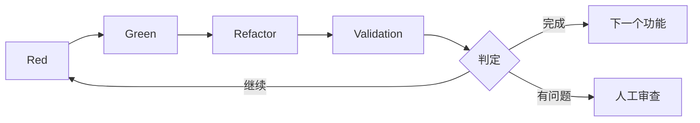

# 3.5 Validation步骤详解

## Validation步骤的定位

Validation步骤是AITDD中最重要的创新之一。通过在传统TDD的Red-Green-Refactor循环中添加这个步骤,实现了AI生成代码的质量保证和完成判定的自动化,从而实现更可靠的开发流程。

## Validation步骤的目的

### 1. 质量保证的多层化
- **功能需求的满足**: 计划的功能得到正确实现
- **回归防止**: 对现有功能无不良影响
- **代码质量**: 生成可维护的高质量代码

### 2. 完成判定的自动化
- 基于客观标准的完成判定
- 人工审查前的预过滤
- 持续的质量监控

### 3. 流程改进的反馈
- 掌握AI生成代码的质量趋势
- 收集改进提示词的信息
- 测量和优化开发效率

## Validation步骤的执行时机



## 具体作业步骤

### 1. 现有测试的绿色状态确认

#### 必须条件
所有现有测试成功是前提条件。

```bash
# 测试执行
$ npm test

# 期望结果
✅ User Authentication › should login with valid credentials
✅ User Authentication › should reject invalid password
✅ User Registration › should create user with valid data
✅ User Registration › should reject duplicate email
✅ Product Management › should create product
✅ Product Management › should list products

Tests: 6 passed, 6 total
Time: 2.341s
Coverage: 94%
```

#### 失败时的应对
```markdown
❌ 测试失败时的应对

1. 失败原因的特定
   - 新实现对现有功能的影响
   - 测试数据的冲突
   - 环境依赖的问题

2. 修正的实施
   - 修正有问题的代码
   - 调整测试数据
   - 重新审视环境设置

3. 通过重新执行确认
   - 重新执行所有测试
   - 确认成功后继续Validation
```

### 2. TDD备忘文件和需求定义文档的确认

#### 确认对象文件
```markdown
## 文档确认列表

### 必须文件
- docs/implements/{{task_id}}/{feature_name}-requirements.md
- docs/implements/{{task_id}}/{feature_name}-testcases.md
- docs/todo.md

### 可选文件(存在的情况下)
- docs/implements/{{task_id}}/{test_case_name}-memo.md
- docs/implements/{{task_id}}/{feature_name}-architecture.md
```

#### 确认内容示例
```markdown
# 用户注册功能 需求确认

## 从requirements.md提取
### 预定功能
- [x] 通过email/password进行新用户注册
- [x] 验证重复email
- [x] 密码强度检查
- [x] 密码哈希化(bcrypt)
- [ ] 速率限制(100件/秒) ← 未实现

### 从testcases.md提取
### 预定测试用例数:10件
- TC001: 正常的用户注册
- TC002: 邮箱地址重复错误
- TC003: 密码不一致错误
- TC004: 无效的邮箱地址格式
- TC005: 密码强度不足
- TC006: 必填项未输入
- TC007: 边界值测试 - 邮箱地址长度
- TC008: 速率限制测试
- TC009: 数据库连接错误
- TC010: CSRF令牌验证
```

### 3. 已实现测试用例的确认

#### 测试文件的分析
```javascript
// __tests__/user-registration.test.js 的分析示例

describe('User Registration', () => {
  // 已实现测试用例的确认
  test('TC001: should create user with valid data', async () => {
    // 已实现 ✅
  });

  test('TC002: should reject duplicate email', async () => {
    // 已实现 ✅
  });

  test('TC003: should reject password mismatch', async () => {
    // 已实现 ✅
  });

  test('TC004: should validate email format', async () => {
    // 已实现 ✅
  });

  test('TC005: should validate password strength', async () => {
    // 已实现 ✅
  });

  test('TC006: should require all fields', async () => {
    // 已实现 ✅
  });

  test('TC007: should handle email length limits', async () => {
    // 已实现 ✅
  });

  test('TC010: should verify CSRF token', async () => {
    // 已实现 ✅
  });

  // TC008, TC009 未实现
});
```

#### 实现状况的汇总
```markdown
## 测试用例实现状况

### 已实现:8件
- TC001: 正常的用户注册 ✅
- TC002: 邮箱地址重复错误 ✅
- TC003: 密码不一致错误 ✅
- TC004: 无效的邮箱地址格式 ✅
- TC005: 密码强度不足 ✅
- TC006: 必填项未输入 ✅
- TC007: 边界值测试 ✅
- TC010: CSRF令牌验证 ✅

### 未实现:2件
- TC008: 速率限制测试 ❌
- TC009: 数据库连接错误 ❌

### 实现率:80% (8/10)
```

### 4. 实现状况的分析和TODO.md更新判定

#### AI的质量风险评估

```markdown
## AI分析报告示例

### 实现完成度评估
- 基本功能实现率: 100%
- 测试用例实现率: 80%
- 需求满足率: 90%

### 未实现项目的重要度分析
#### TC008: 速率限制测试
- 重要度: 中(安全相关)
- 影响范围: 生产环境的滥用风险
- 实现优先度: 中等

#### TC009: 数据库连接错误
- 重要度: 高(可用性相关)
- 影响范围: 系统整体的稳定性
- 实现优先度: 高

### 质量风险评估
- 安全风险: 中(速率限制未实现)
- 可用性风险: 高(DB故障时的行为不明)
- 可维护性风险: 低(代码质量良好)

### 推荐行动
1. TC009(DB连接错误)的优先实现
2. TC008(速率限制)的下期实现考虑
3. 现状下进入下一步是可能的但需注意
```

## Validation的判定标准

### ✅ 完全实现完毕(自动进入下一步)

```markdown
### 完成条件
- 现有测试状态: 全部绿色 ✅
- 测试用例实现率: 100% ✅
- 重要功能完成率: 100% ✅
- 质量风险: 无 ✅
- 安全检查: 合格 ✅

### 自动判定结果
🎉 实现完成 - 自动进入下一个需求定义步骤
```

### ⚠️ 实现不足(需要额外实现)

```markdown
### 继续条件(例1: 有重大未实现)
- 现有测试状态: 全部绿色 ✅
- 测试用例实现率: 70% ❌
- 重要功能完成率: 80% ❌
- 质量风险: 有高风险项目 ❌

### 判定结果
⚠️ 需要额外实现 - 返回Red步骤添加未实现项目

### 继续条件(例2: 现有测试失败)
- 现有测试状态: 有失败 ❌
- 测试用例实现率: 90% ✅
- 重要功能完成率: 95% ✅

### 判定结果
❌ 回归测试失败 - 返回Green/Refactor步骤修正
```

### 🔍 需要判断(需要人工审查)

```markdown
### 难以判断的情况
- 测试用例实现率: 85%(边界值)
- 未实现项目: 难以判断重要度
- 质量风险: 需要组织特有的判断
- 业务需求: 规格解释存在模糊性

### 判定结果
🔍 请求人工审查 - 需要专业知识的判断
```

## AI的判定流程

### 1. 信息收集和分析

#### 输入信息
```markdown
## Validation执行时的输入数据

### 技术信息
- 测试执行结果(成功/失败的详细信息)
- 代码覆盖率报告
- 静态分析结果(ESLint、TypeScript等)
- 性能测试结果

### 规格信息
- requirements.md(功能需求·非功能需求)
- testcases.md(测试用例列表)
- architecture.md(架构设计)

### 项目信息
- 现有代码库
- 依赖关系信息
- 环境设置
```

#### 分析手法
```markdown
## AI分析的方法

### 1. 定量分析
- 测试用例实现率的计算
- 代码覆盖率的评估
- 复杂度指标的测量
- 性能指标的确认

### 2. 定性分析
- 需求与实现的一致性确认
- 代码质量的主观评估
- 安全需求的检查
- 可维护性的评估

### 3. 风险评估
- 未实现功能的影响度分析
- 安全风险的评估
- 运营风险的评估
- 技术债务的评估
```

### 2. 判定逻辑

#### 分层判定系统
```markdown
## 判定的优先顺序

### Level 1: 致命问题(立即继续判定)
1. 现有测试的失败
2. 安全重大问题
3. 数据损坏风险

### Level 2: 重要功能的缺失(推荐继续)
1. 基本功能的未实现
2. 重要错误处理不足
3. 必须验证的缺失

### Level 3: 质量标准(基于阈值的判定)
1. 测试覆盖率 < 80%
2. 测试用例实现率 < 90%
3. 复杂度 > 允许值

### Level 4: 综合判定(完成/继续/需判断)
- 综合上述所有的最终判定
- 与组织质量标准的对照
- 考虑项目情况
```

#### 判定提示词的示例
```markdown
## Validation判定提示词

您是AITDD Validation步骤的质量判定AI。请基于以下信息进行实现完成判定。

### 判定对象
- 功能: 用户注册API
- 实现结果: [代码、测试结果、质量指标]
- 需求: [requirements.md 的内容]
- 测试用例: [testcases.md 的内容]

### 判定标准
1. 现有测试: 全部成功必须
2. 测试用例实现率: 90%以上为完成
3. 重要功能: 100%实现必须
4. 安全: 无重大问题必须

### 输出格式
```json
{
  "判定结果": "完成|继续|需判断",
  "实现率": {
    "测试用例": "80%",
    "重要功能": "100%"
  },
  "质量评估": {
    "安全": "合格|注意|不合格",
    "性能": "良好|普通|需改善",
    "可维护性": "高|中|低"
  },
  "未实现项目": [
    {
      "项目": "TC008",
      "重要度": "中|高|低",
      "推荐行动": "立即实现|下期实现|不需实现"
    }
  ],
  "继续理由": "判定为继续时的理由",
  "下一个行动": "具体的下一步"
}
```
```

## 信号灯系统的推测可视化

### 信号灯系统的活用

在Validation步骤中将AI的推测部分可视化,提高人工审查效率。

#### 🟢 绿灯(高置信度)
```markdown
## 可从原始文件明确推测的内容

### 例:测试用例实现状况
- 🟢 TC001已实现(test文件中有对应测试)
- 🟢 基本功能运行确认完毕(有测试成功结果)
- 🟢 错误处理已实现(需求书中已明确记载)
```

#### 🟡 黄灯(注意·需确认)
```markdown
## 通过推测补充但认为妥当的内容

### 例:质量判定
- 🟡 代码覆盖率80%已足够(基于一般标准的判断)
- 🟡 性能需求未测量但无问题(从实现内容推测)
- 🟡 安全风险中等(因速率限制未实现的推定)
```

#### 🔴 红灯(需验证)
```markdown
## 原始文件中没有,基于独立判断的内容

### 例:业务判断
- 🔴 速率限制的实现优先度"中"(组织方针不明)
- 🔴 DB连接错误处理必须(运营需求未确认)
- 🔴 下期实现即可(项目进度不明)
```

### TODO格式的管理

```markdown
## Validation结果TODO

### 🟢 高置信度项目(推荐确认)
- [ ] 确认[testcases.md](./testcases.md)的TC001-007实现完成
- [ ] 确认[需求书](./requirements.md)的基本功能100%实现

### 🟡 中置信度项目(需确认)
- [ ] 确认[实现代码](./src/users.js)的性能特性
- [ ] 确认[安全需求](./requirements.md)的符合性

### 🔴 需判断项目(重要)
- [ ] 详细确认: 基于组织标准判定[未实现项目](./testcases.md)的实现优先度
- [ ] 详细确认: 确认[运营需求](./requirements.md)的DB故障时需求
- [ ] 详细确认: 基于项目进度调整实现计划
```

## Validation步骤的优化

### 1. 通过提示词改善提高精度

#### 改善要点
```markdown
## 提示词质量提升要点

### 1. 判定标准的明确化
- 数值标准的具体化(覆盖率80%以上等)
- 优先度判定规则的详细化
- 反映组织特有标准

### 2. 上下文信息的充实
- 提供项目背景
- 与现有系统的关系性
- 运营环境的约束条件

### 3. 输出格式的标准化
- JSON格式的结构化输出
- 活用信号灯系统
- TODO格式的课题整理
```

#### 提示词模板的进化
```markdown
## 阶段性提示词改善

### v1.0: 基本版
- 基本判定功能
- 简单的完成/继续判定

### v2.0: 详细化版
- 添加质量指标评估
- 强化风险评估功能
- 引入信号灯系统

### v3.0: 组织优化版
- 纳入组织特有标准
- 考虑项目特性
- 基于学习数据的改善
```

### 2. 自动化范围的扩大

#### 当前的自动化级别
```markdown
## 自动化的现状

### 完全自动化完毕
- 测试执行和结果收集
- 基本质量指标测量
- 标准化判定(有明确标准)

### 半自动化(需人工确认)
- 重要度的判定(业务观点)
- 安全风险评估
- 架构影响的评估

### 必须手工应对
- 与组织方针的一致性确认
- 考虑项目特有情况
- 利益相关者协调
```

#### 自动化扩大的方向性
```markdown
## 未来的自动化计划

### 短期(1-3个月)
- 质量标准的定制功能
- 基于过去实绩的学习功能
- 报告自动生成功能

### 中期(3-6个月)
- 学习组织特有规则
- 自动考虑项目特性
- 利益相关者通知自动化

### 长期(6个月以上)
- 预测性质量管理
- 自动流程优化
- 纳入团队学习
```

## 常见问题和解决方案

### 问题1: 判定标准模糊

**症状**:
- 完成/继续的判定不一致
- 人类和AI的判定存在差异

**原因**:
- 组织特有的质量标准未定义
- 判定规则的模糊性

**解决方案**:
```markdown
### 判定标准的明确化
1. 数值标准的设定
   - 测试覆盖率: 80%以上
   - 测试用例实现率: 90%以上
   - 重要功能完成率: 100%

2. 质量标准的文档化
   - 安全需求检查清单
   - 性能允许值
   - 代码质量标准

3. 异常处理规则的定义
   - 考虑项目特有情况
   - 紧急发布时的标准放宽
   - 技术债务的允许水平
```

### 问题2: 人工审查的瓶颈

**症状**:
- Validation中需判断频发
- 人工审查等待时间增加

**原因**:
- AI判定精度不足
- 组织规则学习不足

**解决方案**:
```markdown
### AI判定精度的提升
1. 学习数据的积累
   - 反馈过去的判定结果
   - 学习成功/失败模式
   - 反映组织特有规则

2. 提示词改善
   - 更具体的判定标准
   - 充实上下文信息
   - 阶段性判定系统

3. 阈值的调整
   - 自动完成标准的严格化
   - 需判断标准的明确化
   - 继续判定精度的提升
```

### 问题3: 过度的质量要求

**症状**:
- 未完成判定的项目多
- 开发效率下降

**原因**:
- 质量标准过于严格
- 完美主义的设定

**解决方案**:
```markdown
### 平衡的质量管理
1. 阶段性质量标准
   - MVP(最小实现)标准
   - 生产环境标准
   - 企业级标准

2. 基于风险的判定
   - 根据影响度调整标准
   - 优先实现重要功能
   - 允许非重要功能延后

3. 持续改进
   - 定期审视标准
   - 反映团队反馈
   - 基于实绩的优化
```

## 总结和下一步

Validation步骤是AITDD流程质量保证的关键,通过适当运用可以:

### 获得的效果
- **质量的稳定化**: 应用一致的质量标准
- **效率的提升**: 优化人工审查
- **持续改进**: 流程改进的反馈循环

### 成功要点
- **明确的标准设定**: 数值化的判定标准
- **阶段性引入**: 适应组织的阶段性应用
- **持续优化**: 基于实绩的流程改进

### 下一步学习
在第3章理解了AITDD流程的全貌后,通过[第4章 实践动手实验](../04-hands-on/01-first-project.md)实际体验AITDD。

通过实际开发,可以体验这个Validation步骤如何运作,如何促进质量提升。
