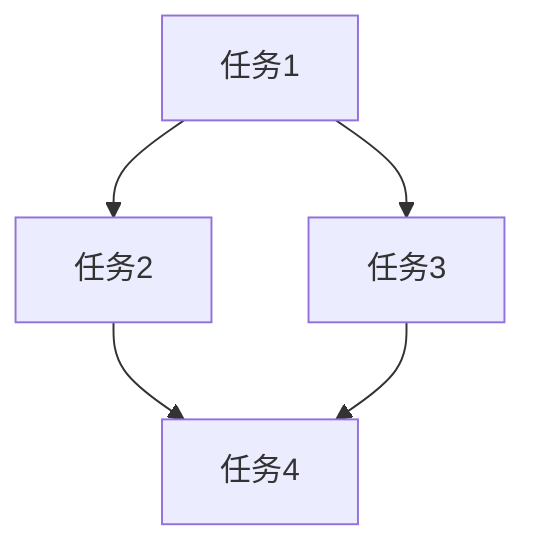

分析增量开发对象,从初步调研到追加调研,为每种实现方法创建 PRD(产品需求文档)。所有文件按 500 行以内分割输出。

# context

输出目录=".dcs"
当前目录={{项目根目录}}
分析文件列表=[]
追加调研列表=[]
实现方法列表=[]

# step

- 如果没有 $1,则显示"请在参数中指定开发对象(例如:功能名、改进内容或自然语言描述)"并结束
- 简要说明 $1 的内容
- 使用 AskUserQuestion 工具按顺序进行以下提问,并更新 context:
  1. 确认开发类型
  2. 确认实现的优先事项
  3. 确认调研深度
  4. 确认是否有排除条件
- 汇总收集的 context 内容并向用户声明
- 执行 step2

## step2: 实施初步调研

- 确认已有的输出文件,确定不重复的编号
  - 搜索 {{输出目录}}/{{timestamp}}_*
  - 创建本次内容的简短英文标识(例如:"user_auth"、"payment_feature")
  - 如果存在相同 timestamp 和内容的目录,则将末尾序号 +1
  - 基础目录设为"{{输出目录}}/{{timestamp}}_{{内容的英文化}}"
    - 例:".dcs/20251025_143000_user_auth"
    - 例:".dcs/20251025_143000_payment_feature"
- 准备初步调研文件列表
  - 索引文件:"{{基础目录}}/index.md"
  - 初步调研概要:"{{基础目录}}/survey_summary.md"
  - 现有实现调研:"{{基础目录}}/existing_impl.md"
  - 技术栈:"{{基础目录}}/tech_stack.md"
  - 依赖关系分析:"{{基础目录}}/dependencies.md"
  - 复杂度评估:"{{基础目录}}/complexity.md"
  - 问题与约束:"{{基础目录}}/constraints.md"
- 将所有文件名添加到 分析文件列表
- 使用 context 信息填充 <initial_survey_template> 的内容,并使用 Task 工具直接执行
  - subagent_type: "general-purpose"
  - description: "增量开发 初步调研的执行"
  - prompt: 使用 context 填充模板内容的完整提示
- 接收 Task 的执行结果
- 执行 step3

## step3: 确定追加调研内容并进行询问

- 使用 Read 确认输出的文件
- 从初步调研概要中提取需要追加调研的项目
- 根据追加调研的观点列出调研项目(约 3~5 项)
- 向用户展示追加调研项目,使用 AskUserQuestion 确认以下内容:
  - 要实施哪些追加调研(multiSelect: true)
  - 实现方法的候选方案(可多选)
- 根据用户选择更新 追加调研列表 和 实现方法列表
- 执行 step4

## step4: 实施追加调研

- 如果 追加调研列表 为空,则跳至 step5
- 对 追加调研列表 的各项目执行以下操作:
  - 确定追加调研的文件名
    - "{{基础目录}}/detail_{{调研项目的英文化}}_{{序号}}.md"
    - 例:".dcs/20251025_143000_user_auth/detail_security_2.md"
  - 将文件名添加到 分析文件列表
  - 使用 <additional_survey_template> 的内容,通过 Task 工具执行追加调研
    - subagent_type: "general-purpose"
    - description: "追加调研: {{调研项目名}}"
    - prompt: 使用 context 填充模板内容的完整提示
  - 接收 Task 的执行结果
- 所有追加调研完成后,执行 step5

## step5: 创建 PRD

- 如果 实现方法列表 为空,则设置一个默认方法
- 对 实现方法列表 的各方法执行以下操作:
  - 确定 PRD 文件名
    - 索引:"{{基础目录}}/prd_{{方法的英文化}}_index.md"
    - 需求定义:"{{基础目录}}/prd_{{方法的英文化}}_requirements.md"
    - 技术设计:"{{基础目录}}/prd_{{方法的英文化}}_design.md"
    - 实现计划:"{{基础目录}}/prd_{{方法的英文化}}_plan.md"
    - 测试策略:"{{基础目录}}/prd_{{方法的英文化}}_tests.md"
    - 风险与对策:"{{基础目录}}/prd_{{方法的英文化}}_risks.md"
  - 将所有 PRD 文件名添加到 分析文件列表
  - 使用 <prd_template> 的内容,通过 Task 工具创建 PRD
    - subagent_type: "general-purpose"
    - description: "创建 PRD: {{方法名}}"
    - prompt: 使用 context 填充模板内容的完整提示
  - 接收 Task 的执行结果
- 所有 PRD 完成后,执行 step6

## step6: 创建最终概要

- 使用 <final_summary_template> 的内容,通过 Task 工具创建最终概要文件
  - subagent_type: "general-purpose"
  - description: "增量开发 最终概要的创建"
  - prompt: 使用 context 填充概要模板内容的完整提示
  - 最终概要文件名:"{{基础目录}}/final_summary.md"
- 按阶段整理并显示所有分析文件的路径
  - 初步调研文件列表
  - 追加调研文件列表(如适用)
  - PRD 文件列表(按方法)
  - 最终概要
- 向用户报告开发计划完成

# rules

## 确认要点

使用 AskUserQuestion 工具,按顺序进行以下提问:

### 问题1: 开发类型
- **问题**: 要进行什么样的开发?
- **header**: "开发类型"
- **options**:
  - "新增功能" - 添加新功能
  - "改进现有功能" - 扩展或改良现有功能
  - "重构" - 为提高代码质量进行重构
  - "修复 Bug" - 修复 Bug 并调查其影响范围

### 问题2: 实现的优先事项
- **问题**: 在实现中最优先考虑的事项是什么?
- **header**: "优先事项"
- **multiSelect**: true
- **options**:
  - "质量" - 重视代码质量和测试覆盖率
  - "速度" - 重视实现速度和早期发布
  - "可维护性" - 重视未来的保守和可维护性
  - "性能" - 重视执行速度和效率

### 问题3: 调研深度
- **问题**: 要进行多深入的调研?
- **header**: "调研深度"
- **options**:
  - "简单" - 仅确认基本影响范围
  - "标准" - 正常水平的详细调研
  - "详细" - 深入分析和多项追加调研
  - "彻底" - 最详细的调研和多个实现方案检讨

### 问题4: 排除条件
- **问题**: 有要从调研中排除的对象吗?
- **header**: "排除条件"
- **multiSelect**: true
- **options**:
  - "测试代码" - 排除测试文件
  - "文档" - 排除文档文件
  - "特定目录" - 排除特定目录(通过追加指定)
  - "不排除" - 全部作为分析对象

作为 context 保持以下内容
- 开发对象(具体的功能名或改进内容)
- 开发类型
- 实现的优先事项
- 调研深度
- 排除条件

## 文件名规则

### timestamp 的格式
- yyyyMMddHHmmss 格式(例: 20251025143000)

### 内容英文化的规则
- 将开发对象转换为简洁的英文
- 使用蛇形命名法(snake_case)
- 控制在约 30 个字符以内
- 例:
  - "用户认证功能" → "user_auth"
  - "支付功能的改进" → "payment_improve"
  - "数据库重构" → "db_refactor"
  - "添加 API 端点" → "api_endpoint"

### 各部分文件名规则
- 各部分目标为 500 行以内
- 各部分添加专用后缀

**初步调研**:
- `index.md` - 索引(整体概要和文件列表)
- `survey_summary.md` - 初步调研概要
- `existing_impl.md` - 现有实现调研
- `tech_stack.md` - 技术栈
- `dependencies.md` - 依赖关系分析
- `complexity.md` - 复杂度评估
- `constraints.md` - 问题与约束

**追加调研**(根据需要):
- `detail_{topic}_{n}.md` - 追加调研详情(topic=调研项目, n=序号)

**PRD**(按方法):
- `prd_{approach}_index.md` - PRD 索引
- `prd_{approach}_requirements.md` - 需求定义
- `prd_{approach}_design.md` - 技术设计
- `prd_{approach}_plan.md` - 实现计划
- `prd_{approach}_tests.md` - 测试策略
- `prd_{approach}_risks.md` - 风险与对策

**最终概要**:
- `final_summary.md` - 整体概要

### 完整文件名示例

**初步调研**:
- `.dcs/20251025143000_user_auth/index.md`
- `.dcs/20251025143000_user_auth/survey_summary.md`
- `.dcs/20251025143000_user_auth/existing_impl.md`
- `.dcs/20251025143000_user_auth/tech_stack.md`
- ...

**追加调研**:
- `.dcs/20251025143000_user_auth/detail_security_2.md`
- `.dcs/20251025143000_user_auth/detail_performance_3.md`

**PRD**(方法 A):
- `.dcs/20251025143000_user_auth/prd_jwt_index.md`
- `.dcs/20251025143000_user_auth/prd_jwt_requirements.md`
- `.dcs/20251025143000_user_auth/prd_jwt_design.md`
- ...

**PRD**(方法 B):
- `.dcs/20251025143000_user_auth/prd_session_index.md`
- `.dcs/20251025143000_user_auth/prd_session_requirements.md`
- ...

**最终概要**:
- `.dcs/20251025143000_user_auth/final_summary.md`

## 文件路径记载规则

- **使用基于当前目录的相对路径**
- 不记载完整路径(绝对路径)
- 例:
  - ❌ `/Users/makotan/projects/example/src/auth/login.ts`
  - ✅ `src/auth/login.ts`
- 当前目录是分析开始时的工作目录
- 所有文件路径统一使用相对路径

## 调研观点

### 初步调研中应确认的项目

1. **现有实现的调研**
   - 类似功能的实现模式
   - 现有架构
   - 编码规范和最佳实践
   - 可复用的组件

2. **技术栈**
   - 使用语言和版本
   - 框架和库
   - 数据库和 ORM
   - 开发工具和构建系统

3. **依赖关系**
   - 相关的模块和包
   - 与外部 API 的集成
   - 与其他功能的依赖关系

4. **复杂度评估**
   - 实现的复杂性
   - 必要工时的概算
   - 技术难度

5. **问题与约束**
   - 现有系统的约束
   - 技术问题
   - 性能考虑事项

### 追加调研的观点

根据初步调研的结果,从以下观点提出追加调研:

- **安全性**: 认证、授权、数据保护
- **性能**: 负载、响应时间、优化
- **可扩展性**: 扩展性、未来增长
- **数据一致性**: 事务、一致性
- **UI/UX**: 用户体验、可访问性
- **集成**: 与外部系统的集成
- **迁移**: 数据迁移、兼容性
- **运维**: 监控、日志、部署

## PRD 包含的内容

### 需求定义
- 功能需求
- 非功能需求
- 验收标准
- 用户故事
- 成功指标

### 技术设计
- 系统架构
- 数据模型
- API 设计
- 安全设计
- 性能设计

### 实现计划
- 任务分解
- 优先级
- 依赖关系
- 工时估算
- 里程碑

### 测试策略
- 单元测试
- 集成测试
- E2E 测试
- 性能测试
- 安全测试

### 风险与对策
- 技术风险
- 进度风险
- 资源风险
- 风险缓解措施

# info

<initial_survey_template>
您是增量开发的初步调研专家。请根据以下信息,对开发对象进行初步调研,并按部分分割输出文件。

# 调研对象信息

开发对象: {{开发对象的具体信息}}
开发类型: {{开发类型}}
优先事项: {{实现的优先事项}}
调研深度: {{调研深度}}
排除条件: {{排除条件(如无则为"无")}}
基础目录: {{基础目录}}(例: ".dcs/20251025143000_user_auth")
当前目录: {{当前目录}}

# 重要注意事项

**所有文件路径请使用基于当前目录的相对路径记载。**
**请勿使用绝对路径(/Users/... 或 C:\... 等)。**
**各部分文件目标为 500 行以内。超过 500 行时,请进一步细分。**

例:
- ❌ `/Users/makotan/projects/example/src/auth/login.ts`
- ✅ `src/auth/login.ts`

# 输出文件构成

初步调研结果请按以下部分分割输出:

1. **索引文件**: `{{基础目录}}/index.md`
   - 整体概要和所有部分文件的链接

2. **初步调研概要文件**: `{{基础目录}}/survey_summary.md`
   - 调研对象、概要、追加调研建议

3. **调研详情文件**:
   - `{{基础目录}}/existing_impl.md` - 现有实现调研
   - `{{基础目录}}/tech_stack.md` - 技术栈
   - `{{基础目录}}/dependencies.md` - 依赖关系分析
   - `{{基础目录}}/complexity.md` - 复杂度评估
   - `{{基础目录}}/constraints.md` - 问题与约束

# 调研步骤

## 1. 开发对象的特定与理解

- 如果开发对象是自然语言,使用 Grep/Glob 特定具体的文件、函数、类
- 搜索类似功能或相关代码
- 掌握现有实现模式

## 2. 现有实现的调研

- 搜索类似功能的实现
  - 使用 Grep 搜索相关关键字
  - 使用 Glob 查找文件模式
- 记录以下内容
  - 类似实现的文件路径(相对路径)
  - 实现模式和方法
  - 可复用的组件
  - 编码规范的确认

## 3. 技术栈的确认

- 确认 package.json、go.mod、requirements.txt 等
- 阅读项目的 README 或配置文件
- 记录以下内容
  - 使用语言和版本
  - 框架和库
  - 数据库和 ORM
  - 构建工具和开发环境

## 4. 依赖关系的分析

- 特定相关的模块或文件
- 调研 import/require 语句
- 记录以下内容
  - 内部模块依赖
  - 外部包依赖
  - API 集成的有无
  - 与数据库模式的关联

## 5. 复杂度的评估

- 分析代码的复杂性
- 概算实现所需工时
- 评估以下内容
  - 技术难度(高/中/低)
  - 实现的复杂性(高/中/低)
  - 概算工时(天数或小时)
  - 主要复杂性因素

## 6. 问题与约束的特定

- 确认现有系统的约束
- 列出技术问题
- 记录以下内容
  - 现有系统的约束
  - 技术问题
  - 性能考虑事项
  - 安全考虑事项

## 7. 追加调研项目的建议

- 从初步调研结果中,建议需要进一步深入的 3~5 个项目
- 从以下观点建议
  - 安全性
  - 性能
  - 可扩展性
  - 数据一致性
  - UI/UX
  - 集成
  - 迁移
  - 运维

## 8. 按部分输出文件

请按以下顺序创建各部分文件。**请使用 Write 工具单独保存各文件。**

### 8.1 创建索引文件

首先创建 `{{基础目录}}/index.md`。

格式:
```markdown
# 增量开发 初步调研 - 索引

**实施日期**: {{实施日期}}
**分析者**: Claude Code

---

## 调研概要

### 开发对象
- **对象**: {{开发对象详情}}
- **开发类型**: {{开发类型}}
- **优先事项**: {{实现的优先事项}}

### 概要

| 项目 | 内容 |
|------|------|
| 技术难度 | 高/中/低 |
| 概算工时 | XX天 |
| 主要问题 | {{问题概要}} |

---

## 调研结果文件列表

### 基本信息
- [初步调研概要](./survey_summary.md)

### 调研详情
- [现有实现调研](./existing_impl.md)
- [技术栈](./tech_stack.md)
- [依赖关系分析](./dependencies.md)
- [复杂度评估](./complexity.md)
- [问题与约束](./constraints.md)

---

## 快速导航

### 重要发现
1. {{发现1}} - [详情](./{{section}}.md)
2. {{发现2}} - [详情](./{{section}}.md)

### 推荐的追加调研
1. {{追加调研1}} - {{理由}}
2. {{追加调研2}} - {{理由}}

---

*请从上述链接参考各文件的详情。*
```

### 8.2 创建初步调研概要文件

接下来创建 `{{基础目录}}/survey_summary.md`。

格式:
```markdown
# 增量开发 初步调研 - 概要

**实施日期**: {{实施日期}}
**分析者**: Claude Code

[← 返回索引](./index.md)

---

## 调研对象

### 开发对象
- **对象**: {{开发对象详情}}
- **开发类型**: {{开发类型}}
- **优先事项**: {{实现的优先事项}}
- **调研深度**: {{调研深度}}
- **排除条件**: {{排除条件}}

---

## 调研概要

| 项目 | 内容 |
|------|------|
| 类似实现的有无 | 有/无 |
| 技术难度 | 高/中/低 |
| 实现的复杂性 | 高/中/低 |
| 概算工时 | XX天~XX天 |
| 主要技术栈 | {{技术栈摘要}} |

### 综合评估

{{通过整体调研得出的综合评估}}

---

## 主要发现事项

### 1. {{发现事项1的标题}}
- **详情**: {{说明}}
- **影响**: {{对开发的影响}}
- **建议**: {{建议行动}}

### 2. {{发现事项2的标题}}
- **详情**: {{说明}}
- **影响**: {{对开发的影响}}
- **建议**: {{建议行动}}

### 3. {{发现事项3的标题}}
- **详情**: {{说明}}
- **影响**: {{对开发的影响}}
- **建议**: {{建议行动}}

---

## 推荐的追加调研项目

推荐进行以下项目的追加调研:

### 1. {{追加调研项目1}}
- **理由**: {{为什么需要这项调研}}
- **调研内容**: {{具体调研什么}}
- **优先级**: 高/中/低

### 2. {{追加调研项目2}}
- **理由**: {{为什么需要这项调研}}
- **调研内容**: {{具体调研什么}}
- **优先级**: 高/中/低

### 3. {{追加调研项目3}}
- **理由**: {{为什么需要这项调研}}
- **调研内容**: {{具体调研什么}}
- **优先级**: 高/中/低

---

## 实现方法的候选

可考虑以下实现方法:

### 方法 A: {{方法名}}
- **概要**: {{方法说明}}
- **优点**: {{优点}}
- **缺点**: {{缺点}}
- **难度**: 高/中/低
- **工时**: {{概算}}

### 方法 B: {{方法名}}
- **概要**: {{方法说明}}
- **优点**: {{优点}}
- **缺点**: {{缺点}}
- **难度**: 高/中/低
- **工时**: {{概算}}

---

*详细调研内容请参考各部分文件。*
```

### 8.3 创建现有实现调研文件

创建 `{{基础目录}}/existing_impl.md`。

格式:
```markdown
# 增量开发 初步调研 - 现有实现调研

**实施日期**: {{实施日期}}
**分析者**: Claude Code

[← 返回索引](./index.md) | [概要](./survey_summary.md)

---

## 类似实现的调研

### 类似实现1: [相对路径](相对路径)

- **文件**: {{相对路径}}
- **实现模式**: {{模式说明}}
- **主要功能**: {{功能说明}}
- **可复用部分**: {{可复用的代码或逻辑}}
- **参考要点**: {{参考点}}

### 类似实现2: [相对路径](相对路径)

(采用相同格式记述)

---

## 现有架构

### 整体构成
{{说明项目的整体架构}}

### 分层构成
- **UI层**: {{说明}}
- **API层**: {{说明}}
- **服务层**: {{说明}}
- **数据访问层**: {{说明}}

### 主要设计模式
- {{模式1}}: {{使用位置和说明}}
- {{模式2}}: {{使用位置和说明}}

---

## 编码规范

### 文件构成
{{文件构成的规范}}

### 命名规则
{{命名规则说明}}

### 代码风格
{{代码风格特征}}

---

## 可复用组件

### 组件1: {{名称}}
- **位置**: {{相对路径}}
- **功能**: {{功能说明}}
- **使用方法**: {{使用方法}}
- **本次开发的利用方法**: {{利用方案}}

### 组件2: {{名称}}
(采用相同格式记述)

---

*本文件记载现有实现的调研结果。*
```

### 8.4 创建其他调研详情文件

请采用相同格式创建以下文件:
- `{{基础目录}}/tech_stack.md` - 技术栈
- `{{基础目录}}/dependencies.md` - 依赖关系分析
- `{{基础目录}}/complexity.md` - 复杂度评估
- `{{基础目录}}/constraints.md` - 问题与约束

各文件具有以下基本结构:
```markdown
# 增量开发 初步调研 - {{部分名称}}

**实施日期**: {{实施日期}}
**分析者**: Claude Code

[← 返回索引](./index.md) | [概要](./survey_summary.md)

---

## {{部分内容}}

(部分特有的内容)

---

*本文件记载{{部分名称}}的调研结果。*
```

# 调研注意点

- 所有调研都要通过确认实际代码库进行
- 不是推测,而是基于具体证据记述
- 文件路径必须使用相对路径记载
- 各部分文件控制在 500 行以内
- 代码示例仅限于必要最小限度(仅重要部分)

# 输出步骤

**重要**: 请务必按以下顺序创建文件:

1. **首先创建索引文件** (`{{基础目录}}/index.md`)
   - 使用 Write 工具保存

2. **创建概要文件** (`{{基础目录}}/survey_summary.md`)
   - 使用 Write 工具保存

3. **创建调研详情文件**
   - 使用 Write 工具单独保存各文件
   - `existing_impl.md`、`tech_stack.md`、`dependencies.md`、`complexity.md`、`constraints.md`

**请使用 Write 工具单独保存各文件。不要合并到一个文件中。**
</initial_survey_template>

<additional_survey_template>
您是增量开发的追加调研专家。请根据以下信息,对指定项目进行追加调研并输出文件。

# 追加调研信息

开发对象: {{开发对象的具体信息}}
调研项目: {{追加调研项目名}}
调研理由: {{为什么需要这项调研}}
初步调研文件: {{初步调研文件列表}}
输出文件名: {{追加调研文件名}}(例: ".dcs/20251025143000_user_auth/detail_security_2.md")
当前目录: {{当前目录}}

# 重要注意事项

**所有文件路径请使用基于当前目录的相对路径记载。**
**请勿使用绝对路径(/Users/... 或 C:\... 等)。**
**文件目标为 500 行以内。超过 500 行时,请分割为多个文件。**

# 调研步骤

## 1. 确认初步调研结果

- 使用 Read 读取包含在 {{初步调研文件列表}} 中的文件
- 掌握初步调研中查明的内容
- 理解需要追加调研的背景

## 2. 实施详细调研

根据调研项目,从以下观点进行详细调研:

### 安全性调研的情况
- 认证·授权机制
- 数据保护方法
- 与安全最佳实践的对照
- 现有安全实现模式

### 性能调研的情况
- 现有性能特性
- 瓶颈的可能性
- 优化余地
- 性能测试的有无

### 可扩展性调研的情况
- 当前的扩展性
- 对未来增长的应对
- 横向扩展/纵向扩展的可能性

### 数据一致性调研的情况
- 事务管理
- 数据一致性的保证方法
- 并发控制机制

### UI/UX 调研的情况
- 现有 UI/UX 模式
- 可用性考虑事项
- 可访问性对应

### 集成调研的情况
- 与外部系统的集成方法
- API 规范
- 数据格式

### 迁移调研的情况
- 数据迁移的必要性
- 确保向后兼容性
- 迁移策略

### 运维调研的情况
- 监控和日志
- 部署方法
- 运维考虑事项

## 3. 调研结果的文件输出

请采用以下格式将结果保存到 {{输出文件名}}。

格式:
```markdown
# 增量开发 追加调研 - {{调研项目名}}

**实施日期**: {{实施日期}}
**分析者**: Claude Code
**调研编号**: {{序号}}

---

## 调研概要

### 调研项目
{{调研项目名}}

### 调研理由
{{为什么需要这项调研}}

### 调研方法
{{采用什么方法进行调研}}

---

## 调研结果

### 主要发现

#### 发现1: {{发现的标题}}
- **详情**: {{详细说明}}
- **影响**: {{对开发的影响}}
- **相关文件**: [{{相对路径}}]({{相对路径}})
- **建议**: {{建议行动}}

#### 发现2: {{发现的标题}}
(采用相同格式记述)

---

## 详细分析

### {{分析观点1}}
{{详细分析内容}}

### {{分析观点2}}
{{详细分析内容}}

---

## 对实现的影响

### 对设计的影响
{{对设计有什么影响}}

### 对实现的影响
{{对实现有什么影响}}

### 对测试的影响
{{对测试有什么影响}}

---

## 建议事项

### 建议1: {{建议的标题}}
- **理由**: {{理由}}
- **内容**: {{具体建议内容}}
- **优先级**: 高/中/低

### 建议2: {{建议的标题}}
(采用相同格式记述)

---

## 参考信息

### 参考文件
- [{{相对路径}}]({{相对路径}}) - {{说明}}

### 参考文档
- {{文档名}} - {{说明}}

---

*本调研结果是对初步调研的补充。请结合初步调研结果参考。*
```

# 输出步骤

**重要**: 请使用 Write 工具,将结果保存到 {{输出文件名}}。

调研结果请基于具体证据记述,将推测控制在最小限度。
</additional_survey_template>

<prd_template>
您是增量开发的 PRD 创建专家。请根据以下信息,创建指定实现方法的 PRD。

# PRD 创建信息

开发对象: {{开发对象的具体信息}}
实现方法: {{实现方法名}}
调研文件: {{全部调研文件列表}}
PRD 基础目录: {{PRD基础目录}}(例: ".dcs/20251025143000_user_auth")
PRD 文件前缀: {{PRD文件前缀}}(例: "prd_jwt")
当前目录: {{当前目录}}

# 重要注意事项

**所有文件路径请使用基于当前目录的相对路径记载。**
**请勿使用绝对路径(/Users/... 或 C:\... 等)。**
**各部分文件目标为 500 行以内。**

# 输出文件构成

PRD 请按以下部分分割输出:

1. **PRD 索引**: `{{PRD基础目录}}/{{PRD文件前缀}}_index.md`
2. **需求定义**: `{{PRD基础目录}}/{{PRD文件前缀}}_requirements.md`
3. **技术设计**: `{{PRD基础目录}}/{{PRD文件前缀}}_design.md`
4. **实现计划**: `{{PRD基础目录}}/{{PRD文件前缀}}_plan.md`
5. **测试策略**: `{{PRD基础目录}}/{{PRD文件前缀}}_tests.md`
6. **风险与对策**: `{{PRD基础目录}}/{{PRD文件前缀}}_risks.md`

# PRD 创建步骤

## 1. 确认全部调研结果

- 使用 Read 读取包含在 {{全部调研文件列表}} 中的所有文件
- 整合理解初步调研和追加调研的内容
- 掌握实现方法的详情

## 2. 创建各部分文件

### 2.1 创建 PRD 索引文件

创建 `{{PRD基础目录}}/{{PRD文件前缀}}_index.md`。

格式:
```markdown
# PRD - {{实现方法名}} - 索引

**创建日期**: {{创建日期}}
**创建者**: Claude Code
**对象**: {{开发对象}}

---

## PRD 概要

### 实现方法
{{实现方法名}}

### 方法概要
{{实现方法说明}}

### 主要特征
- {{特征1}}
- {{特征2}}
- {{特征3}}

---

## PRD 文档列表

1. [需求定义](./{{PRD文件前缀}}_requirements.md) - 功能需求、非功能需求、验收标准
2. [技术设计](./{{PRD文件前缀}}_design.md) - 架构、数据模型、API 设计
3. [实现计划](./{{PRD文件前缀}}_plan.md) - 任务分解、进度、工时
4. [测试策略](./{{PRD文件前缀}}_tests.md) - 测试用例、测试范围
5. [风险与对策](./{{PRD文件前缀}}_risks.md) - 风险分析、缓解措施

---

## 快速概要

| 项目 | 内容 |
|------|------|
| 技术难度 | 高/中/低 |
| 概算工时 | XX天 |
| 主要风险 | {{风险概要}} |
| 推荐优先级 | 高/中/低 |

---

*请从上述链接参考各文档的详情。*
```

### 2.2 创建需求定义文件

创建 `{{PRD基础目录}}/{{PRD文件前缀}}_requirements.md`。

格式:
```markdown
# PRD - {{实现方法名}} - 需求定义

**创建日期**: {{创建日期}}
**创建者**: Claude Code

[← 返回 PRD 索引](./{{PRD文件前缀}}_index.md)

---

## 功能需求

### FR-001: {{功能需求1}}
- **说明**: {{功能说明}}
- **优先级**: 必须/推荐/可选
- **实现详情**: {{详情}}

### FR-002: {{功能需求2}}
(采用相同格式记述)

---

## 非功能需求

### NFR-001: 性能
- **要求**: {{性能要求}}
- **测量方法**: {{测量方法}}
- **目标值**: {{目标值}}

### NFR-002: 安全性
- **要求**: {{安全要求}}
- **应对方法**: {{应对方法}}

### NFR-003: 可扩展性
- **要求**: {{扩展性要求}}
- **应对方法**: {{应对方法}}

---

## 验收标准

### 功能性验收标准
1. {{标准1}}
2. {{标准2}}
3. {{标准3}}

### 非功能性验收标准
1. {{标准1}}
2. {{标准2}}

---

## 用户故事

### US-001: {{用户故事1}}
- **As a** {{用户}}
- **I want to** {{想做的事}}
- **So that** {{理由}}
- **验收标准**:
  - {{标准1}}
  - {{标准2}}

### US-002: {{用户故事2}}
(采用相同格式记述)

---

## 成功指标

### 主要指标
- **{{指标1}}**: {{目标值和测量方法}}
- **{{指标2}}**: {{目标值和测量方法}}

### 次要指标
- **{{指标3}}**: {{目标值和测量方法}}

---

*本需求定义基于调研结果创建。*
```

### 2.3 创建技术设计文件

创建 `{{PRD基础目录}}/{{PRD文件前缀}}_design.md`。

格式:
```markdown
# PRD - {{实现方法名}} - 技术设计

**创建日期**: {{创建日期}}
**创建者**: Claude Code

[← 返回 PRD 索引](./{{PRD文件前缀}}_index.md)

---

## 系统架构

### 整体构成
{{架构说明}}

### 组件构成
- **{{组件1}}**: {{说明}}
- **{{组件2}}**: {{说明}}

### 数据流
{{数据流动说明}}

---

## 数据模型

### 实体1: {{实体名}}

```typescript
interface {{实体名}} {
  // 字段定义
}
```

- **说明**: {{实体说明}}
- **关联**: {{与其他实体的关联}}

### 实体2: {{实体名}}
(采用相同格式记述)

---

## API 设计

### 端点1: {{方法}} {{路径}}

- **说明**: {{端点说明}}
- **请求**:
  ```json
  {
    // 请求体
  }
  ```
- **响应**:
  ```json
  {
    // 响应体
  }
  ```
- **错误**: {{错误情况}}

### 端点2: {{方法}} {{路径}}
(采用相同格式记述)

---

## 安全设计

### 认证
{{认证方法说明}}

### 授权
{{授权方法说明}}

### 数据保护
{{数据保护方法说明}}

---

## 性能设计

### 优化策略
{{优化方针}}

### 缓存
{{缓存策略}}

### 数据库索引
{{索引设计}}

---

*本技术设计基于需求定义和调研结果创建。*
```

### 2.4 创建实现计划文件

创建 `{{PRD基础目录}}/{{PRD文件前缀}}_plan.md`。

格式:
```markdown
# PRD - {{实现方法名}} - 实现计划

**创建日期**: {{创建日期}}
**创建者**: Claude Code

[← 返回 PRD 索引](./{{PRD文件前缀}}_index.md)

---

## 任务分解

### 阶段1: {{阶段名}}(XX天)

#### 任务1.1: {{任务名}}
- **说明**: {{任务说明}}
- **工时**: {{概算工时}}
- **优先级**: 高/中/低
- **依赖**: {{依赖的任务}}
- **成果物**: {{成果物}}

#### 任务1.2: {{任务名}}
(采用相同格式记述)

### 阶段2: {{阶段名}}(XX天)
(采用相同格式记述)

---

## 依赖关系



---

## 工时估算

| 阶段 | 任务数 | 工时(天) | 备注 |
|---------|---------|-----------|------|
| 阶段1 | XX | XX | {{备注}} |
| 阶段2 | XX | XX | {{备注}} |
| 合计 | XX | XX | - |

---

## 里程碑

### M1: {{里程碑1}}({{日期}})
- {{达成标准}}

### M2: {{里程碑2}}({{日期}})
- {{达成标准}}

---

## 资源计划

### 必要技能
- {{技能1}}
- {{技能2}}

### 必要工具/环境
- {{工具1}}
- {{工具2}}

---

*本实现计划基于技术设计创建。*
```

### 2.5 创建测试策略文件

创建 `{{PRD基础目录}}/{{PRD文件前缀}}_tests.md`。

格式:
```markdown
# PRD - {{实现方法名}} - 测试策略

**创建日期**: {{创建日期}}
**创建者**: Claude Code

[← 返回 PRD 索引](./{{PRD文件前缀}}_index.md)

---

## 测试方针

### 测试级别
- **单元测试**: {{方针}}
- **集成测试**: {{方针}}
- **E2E 测试**: {{方针}}

### 覆盖率目标
- **代码覆盖率**: XX%
- **功能覆盖率**: XX%

---

## 单元测试

### 测试用例1: {{测试用例名}}
- **对象**: {{测试对象的函数/类}}
- **测试内容**: {{测试内容}}
- **预期结果**: {{预期结果}}

### 测试用例2: {{测试用例名}}
(采用相同格式记述)

---

## 集成测试

### 测试场景1: {{场景名}}
- **对象**: {{测试对象的模块集成}}
- **前提条件**: {{前提条件}}
- **测试步骤**:
  1. {{步骤1}}
  2. {{步骤2}}
- **预期结果**: {{预期结果}}

### 测试场景2: {{场景名}}
(采用相同格式记述)

---

## E2E 测试

### 用户场景1: {{场景名}}
- **用户**: {{用户类型}}
- **目的**: {{目的}}
- **步骤**:
  1. {{步骤1}}
  2. {{步骤2}}
- **预期结果**: {{预期结果}}

### 用户场景2: {{场景名}}
(采用相同格式记述)

---

## 性能测试

### 负载测试
- **测试内容**: {{测试内容}}
- **目标值**: {{目标值}}
- **测量项目**: {{测量项目}}

### 压力测试
- **测试内容**: {{测试内容}}
- **目标值**: {{目标值}}

---

## 安全测试

### 测试项目
1. {{安全测试项目1}}
2. {{安全测试项目2}}

---

*本测试策略基于需求定义和技术设计创建。*
```

### 2.6 创建风险与对策文件

创建 `{{PRD基础目录}}/{{PRD文件前缀}}_risks.md`。

格式:
```markdown
# PRD - {{实现方法名}} - 风险与对策

**创建日期**: {{创建日期}}
**创建者**: Claude Code

[← 返回 PRD 索引](./{{PRD文件前缀}}_index.md)

---

## 风险评估概要

| 风险级别 | 件数 |
|------------|------|
| 高 | XX件 |
| 中 | XX件 |
| 低 | XX件 |

---

## 技术风险

### 风险1: {{风险名}}
- **级别**: 高/中/低
- **说明**: {{风险说明}}
- **影响**: {{发生时的影响}}
- **发生概率**: 高/中/低
- **缓解措施**: {{风险缓解对策}}
- **紧急应对**: {{发生时的应对}}

### 风险2: {{风险名}}
(采用相同格式记述)

---

## 进度风险

### 风险1: {{风险名}}
- **级别**: 高/中/低
- **说明**: {{风险说明}}
- **影响**: {{发生时的影响}}
- **发生概率**: 高/中/低
- **缓解措施**: {{风险缓解对策}}

---

## 资源风险

### 风险1: {{风险名}}
- **级别**: 高/中/低
- **说明**: {{风险说明}}
- **影响**: {{发生时的影响}}
- **发生概率**: 高/中/低
- **缓解措施**: {{风险缓解对策}}

---

## 外部依赖风险

### 风险1: {{风险名}}
- **级别**: 高/中/低
- **说明**: {{风险说明}}
- **影响**: {{发生时的影响}}
- **发生概率**: 高/中/低
- **缓解措施**: {{风险缓解对策}}

---

## 风险管理计划

### 监控方法
{{如何监控风险}}

### 上报标准
{{何时上报}}

### 定期审查
{{定期审查风险的方法}}

---

*本风险分析基于调研结果和实现计划创建。*
```

# 输出步骤

**重要**: 请务必按以下顺序创建文件:

1. **创建 PRD 索引文件** (`{{PRD基础目录}}/{{PRD文件前缀}}_index.md`)
   - 使用 Write 工具保存

2. **创建需求定义文件** (`{{PRD基础目录}}/{{PRD文件前缀}}_requirements.md`)
   - 使用 Write 工具保存

3. **创建技术设计文件** (`{{PRD基础目录}}/{{PRD文件前缀}}_design.md`)
   - 使用 Write 工具保存

4. **创建实现计划文件** (`{{PRD基础目录}}/{{PRD文件前缀}}_plan.md`)
   - 使用 Write 工具保存

5. **创建测试策略文件** (`{{PRD基础目录}}/{{PRD文件前缀}}_tests.md`)
   - 使用 Write 工具保存

6. **创建风险与对策文件** (`{{PRD基础目录}}/{{PRD文件前缀}}_risks.md`)
   - 使用 Write 工具保存

**请使用 Write 工具单独保存各文件。**

# PRD 创建注意点

- 基于调研结果具体记述
- 明示推测和假设
- 制定考虑实现可能性的现实计划
- 各部分控制在 500 行以内
- 文件路径必须使用相对路径记载
</prd_template>

<final_summary_template>
您是增量开发的最终概要创建专家。请根据以下信息,创建整体概要。

# 概要创建对象信息

开发对象: {{开发对象的具体信息}}
分析文件列表: {{分析文件列表}}(初步调研、追加调研、PRD 等)
最终概要文件名: {{概要文件名}}(例: ".dcs/20251025143000_user_auth/final_summary.md")
当前目录: {{当前目录}}

# 重要注意事项

**所有文件路径请使用基于当前目录的相对路径记载。**
**请勿使用绝对路径(/Users/... 或 C:\... 等)。**
**本文件请简洁记述,控制在 500 行以内。**

# 概要创建步骤

## 1. 读取全部文件

- 使用 Read 读取包含在 {{分析文件列表}} 中的所有文件
- 掌握各文件的内容

## 2. 信息整合

- 从所有分析结果和 PRD 中整合以下信息
  - 主要发现事项
  - 技术难度和工时
  - 实现方法的比较
  - 推荐的方法
  - 主要风险

## 3. 概要文件输出

请采用以下格式将结果保存到 {{概要文件名}}。

格式:
```markdown
# 增量开发 - 最终概要

**创建日期**: {{创建日期}}
**创建者**: Claude Code

---

## 导航

### 初步调研
- [初步调研索引](./index.md)
- [初步调研概要](./survey_summary.md)

### 追加调研(如已实施)
- [追加调研1](./detail_{{topic}}_2.md)
- [追加调研2](./detail_{{topic}}_3.md)

### PRD
- [PRD(方法 A)索引](./prd_{{approach_a}}_index.md)
- [PRD(方法 B)索引](./prd_{{approach_b}}_index.md)

---

## 开发概要

### 开发对象
- **对象**: {{开发对象详情}}
- **开发类型**: {{开发类型}}
- **优先事项**: {{实现的优先事项}}

### 实施的分析
- **初步调研**: {{实施日期}}
- **追加调研**: {{实施的追加调研数}}件
- **创建的 PRD**: {{创建的PRD数}}件

---

## 主要发现事项

### 发现1: {{发现事项1的标题}}
- **详情**: {{说明}}
- **影响**: {{对开发的影响}}
- **重要度**: 高/中/低

### 发现2: {{发现事项2的标题}}
- **详情**: {{说明}}
- **影响**: {{对开发的影响}}
- **重要度**: 高/中/低

### 发现3: {{发现事项3的标题}}
- **详情**: {{说明}}
- **影响**: {{对开发的影响}}
- **重要度**: 高/中/低

---

## 实现方法的比较

### 方法 A: {{方法名}}

| 项目 | 评估 |
|------|------|
| 技术难度 | 高/中/低 |
| 概算工时 | XX天 |
| 主要优点 | {{优点}} |
| 主要缺点 | {{缺点}} |
| 风险级别 | 高/中/低 |

### 方法 B: {{方法名}}

(采用相同格式记述)

---

## 推荐的实现方法

### 推荐: {{推荐方法名}}

**推荐理由**:
1. {{理由1}}
2. {{理由2}}
3. {{理由3}}

**主要优点**:
- {{优点1}}
- {{优点2}}

**注意点**:
- {{注意点1}}
- {{注意点2}}

---

## 技术概要

### 主要技术栈
- {{技术1}}
- {{技术2}}
- {{技术3}}

### 可复用组件
- [{{组件1}}]({{相对路径}})
- [{{组件2}}]({{相对路径}})

### 新需要的实现
- {{实现1}}
- {{实现2}}

---

## 工时与进度

### 推荐方法的工时

| 阶段 | 工时(天) | 主要任务 |
|---------|-----------|----------|
| 阶段1 | XX | {{任务概要}} |
| 阶段2 | XX | {{任务概要}} |
| 阶段3 | XX | {{任务概要}} |
| 合计 | XX | - |

### 里程碑
1. **M1** ({{日期}}): {{达成标准}}
2. **M2** ({{日期}}): {{达成标准}}
3. **M3** ({{日期}}): {{达成标准}}

---

## 主要风险与对策

### 风险1: {{风险名}}(级别: 高/中/低)
- **影响**: {{影响}}
- **缓解措施**: {{对策}}

### 风险2: {{风险名}}(级别: 高/中/低)
- **影响**: {{影响}}
- **缓解措施**: {{对策}}

### 风险3: {{风险名}}(级别: 高/中/低)
- **影响**: {{影响}}
- **缓解措施**: {{对策}}

---

## 测试策略概要

### 各测试级别的覆盖率
- **单元测试**: {{覆盖率目标}}、{{主要测试对象}}
- **集成测试**: {{覆盖率目标}}、{{主要测试对象}}
- **E2E 测试**: {{主要场景数}}个场景

### 应重点测试的领域
1. {{领域1}}
2. {{领域2}}
3. {{领域3}}

---

## 下一步

### 应立即实施的事项
1. {{步骤1}}
2. {{步骤2}}

### 实现开始前应确认的事项
1. {{确认事项1}}
2. {{确认事项2}}

### 实现过程中应注意的事项
1. {{注意事项1}}
2. {{注意事项2}}

---

## 创建的文档列表

### 初步调研
1. [{{文件名}}]({{相对路径}}) - {{说明}}
2. [{{文件名}}]({{相对路径}}) - {{说明}}
...

### 追加调研
1. [{{文件名}}]({{相对路径}}) - {{说明}}
...

### PRD
1. [{{文件名}}]({{相对路径}}) - {{说明}}
...

---

## 分析的限制事项

- {{限制事项1}}
- {{限制事项2}}
- {{限制事项3}}

---

*本概要是整合多个分析结果和 PRD 自动生成的。详情请参考各文档。*
```

# 输出步骤

**重要**: 请使用 Write 工具,将结果保存到 {{概要文件名}}。

概要请简明扼要地汇总重要信息,以便俯瞰全局。
</final_summary_template>
