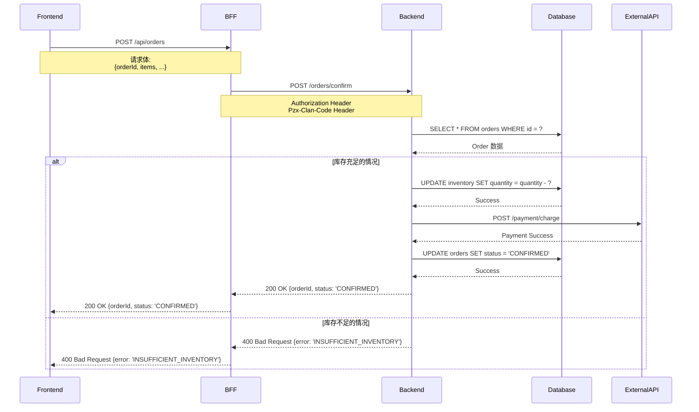

以 mermaid 格式创建指定功能的时序图。将调查结果保存到临时文件中,通过 Task 引用来实现上下文精简。

# context

输出目录=".dcs"
当前目录={{项目根目录}}
分析文件列表=[]
功能已特定=false
对象功能=[]
基础目录=""
tmp目录=""

# step

- 如果没有 $1,则显示"请在参数中指定功能名或对象(例如:订单确定处理、OrderController.confirmOrder、src/api/order 等)"并结束
- 简要说明 $1 的内容
- 执行 step2

## step2

- 如果 $1 没有指向具体功能(自然语言的一般描述、目录路径等):
  - 使用 Grep/Glob 调查与 $1 相关的功能
  - 从调查结果中列出具体的功能候选
  - 使用 AskUserQuestion 工具让用户选择对象功能
    - **问题**: 要创建哪个功能的时序图?
    - **header**: "对象功能的选择"
    - **multiSelect**: true
    - **options**: {{从调查结果提取的功能列表}}(最多约10项)
  - 将选择的功能设为 对象功能,并将 功能已特定=true
- 如果 $1 指向具体功能(函数名、类名、特定端点等):
  - 将该功能设为 对象功能,并将 功能已特定=true
- 向用户声明对象功能并获得确认
- 使用 AskUserQuestion 工具按顺序进行以下提问,并更新 context:
  1. 确认图中包含的场景
  2. 确认详细级别
  3. 确认是否有排除条件
- 汇总收集的 context 内容并向用户声明
- 执行 step2.5

## step2.5 (初步调查和临时文件创建)

- 确认已有的输出文件,确定不重复的编号
  - 搜索 {{输出目录}}/{{timestamp}}_*
  - 创建本次内容的简短英文标识(例如:"order_confirmation"、"cart_update")
  - 如果存在相同 timestamp 和内容的目录,则将末尾序号 +1
  - 基础目录设为"{{输出目录}}/{{timestamp}}_{{内容的英文化}}"
    - 例:".dcs/20251027_123456_order_confirmation"
  - tmp目录设为"{{基础目录}}/tmp"
- 创建 tmp 目录(使用 Bash 的 mkdir -p)
- 使用 Task 工具实施对象功能的初步调查,并将结果保存到以下临时文件:

### 调查文件结构
1. **组件分析**: `{{tmp目录}}/component_analysis.md`
   - 相关组件(Frontend、BFF、Backend、Database、External API)的信息
   - 各组件的角色、技术栈、主要文件路径(相对路径)

2. **处理流程分析**: `{{tmp目录}}/flow_analysis.md`
   - 入口点信息(文件路径、函数名、行号)
   - 主要处理步骤和调用顺序
   - 处理的分支条件
   - 数据库访问或外部 API 调用的概要

3. **错误处理分析**: `{{tmp目录}}/error_handling.md`
   - 验证错误的模式
   - 业务逻辑错误的模式
   - 系统错误、外部 API 故障的处理
   - 认证/授权错误的处理

4. **重要文件摘录**: `{{tmp目录}}/file_contents/`
   - 摘录各重要文件的相关部分并保存
   - 文件名:`controller.md`、`service.md`、`repository.md` 等
   - 各文件包含以下内容:
     - 原始文件路径(相对路径)
     - 相关函数/方法的摘录(最多约200行)
     - 重要注释或注解

### 调查实施步骤
1. 使用 Grep/Glob 特定与对象功能相关的文件
2. 使用 Read 确认主要文件的内容(仅必要部分)
3. 将组件分析结果 Write 到 `component_analysis.md`
4. 将处理流程分析结果 Write 到 `flow_analysis.md`
5. 将错误处理分析结果 Write 到 `error_handling.md`
6. 将重要文件摘录 Write 到 `file_contents/*.md`(各文件单独保存)
7. 向用户报告创建的调查文件路径

- 执行 step3

## step3

- 准备分析结果文件列表
  - 索引文件:"{{基础目录}}/index.md"
  - 概要文件:"{{基础目录}}/summary.md"
  - 时序图文件:"{{基础目录}}/sequence_success.md" (成功模式)
  - 时序图文件:"{{基础目录}}/sequence_error.md" (错误模式)
  - 时序图文件:"{{基础目录}}/sequence_exception.md" (异常模式)
  - 分析详情文件:"{{基础目录}}/details.md"
- 将所有文件名添加到 分析文件列表
- 使用 context 信息填充 <sequence_diagram_template> 的内容,并通过 Task 工具执行
  - subagent_type: "general-purpose"
  - description: "时序图的创建"
  - prompt: 使用 context 填充模板内容的完整提示
    - **重要**: 传递调查结果文件的路径,在 Task 内使用 Read 读取
- 接收 Task 的执行结果
- 执行 step4

## step4

- 使用 Read 确认输出的文件
- 根据 深入内容的规则 判断是否需要追加调查
- 需要追加调查的情况:
  - 向用户展示追加调查的内容列表
  - 获得用户批准
  - 如有多个追加调查项目,对各项目单独处理:
    1. 创建追加调查用的临时文件(`{{tmp目录}}/additional_N_*.md`)
    2. 使用 Task 工具执行追加调查(传递调查结果文件的路径)
    3. 对各项目以新的序号保存为追加文件(例:"2_sequence_success.md"、"3_sequence_error.md")
    4. 将各文件名添加到 分析文件列表
  - 再次执行 step4(重复直到不需要追加调查,最多5次)
- 不需要追加调查的情况:
  - 执行 step5

## step5

- 使用 <summary_template> 的内容,通过 Task 工具创建最终概要文件
  - subagent_type: "general-purpose"
  - description: "时序图创建 最终概要的创建"
  - prompt: 使用 context 填充概要模板内容的完整提示
    - **重要**: 传递分析文件列表,在 Task 内使用 Read 读取
  - 最终概要文件名:"{{基础目录}}/final_summary.md"
- 按分析次数整理并显示所有分析文件的路径
  - 初次分析文件列表(索引、概要、时序图等)
  - 追加调查文件列表(如适用)
  - 最终概要
- 说明临时文件(tmp目录)
  - 调查结果保存在 `{{tmp目录}}`
  - 可根据需要参考
- 向用户报告分析完成

# rules

## 确认要点

使用 AskUserQuestion 工具,按顺序进行以下提问:

### 问题1: 图中包含的场景
- **问题**: 要创建哪些场景的时序图?
- **header**: "场景选择"
- **multiSelect**: true
- **options**:
  - "成功模式" - 正常处理流程
  - "验证错误" - 输入值验证错误的模式
  - "业务逻辑错误" - 违反业务规则的模式
  - "异常模式" - 系统错误、外部 API 故障等
  - "认证/授权错误" - 认证·授权失败的模式
  - "全部" - 包含所有模式

### 问题2: 详细级别
- **问题**: 时序图的详细级别要多详细?
- **header**: "详细级别"
- **options**:
  - "概要级别" - 仅主要组件间的处理流程
  - "标准级别" - 组件间的主要处理和数据流
  - "详细级别" - 包含内部处理、方法调用、数据转换

### 问题3: 排除条件
- **问题**: 有要从时序图中排除的对象吗?
- **header**: "排除条件"
- **multiSelect**: true
- **options**:
  - "日志输出处理" - 排除日志输出的记述
  - "验证详情" - 简化验证的详情
  - "数据转换处理" - 简化数据转换的详情
  - "缓存处理" - 排除缓存访问
  - "不排除" - 全部包含

作为 context 保持以下内容
- 对象功能(具体的功能名、端点、函数名等)
- 图中包含的场景
- 详细级别
- 排除条件
- 基础目录
- tmp目录

## 文件名规则

### timestamp 的格式
- yyyyMMddHHmmss 格式(例: 20251027123456)

### 内容英文化的规则
- 将对象功能转换为简洁的英文
- 使用蛇形命名法(snake_case)
- 控制在约 30 个字符以内
- 例:
  - "订单确定处理" → "order_confirmation"
  - "购物车更新" → "cart_update"
  - "OrderController.confirmOrder" → "order_confirm"
  - "商品库存确认" → "inventory_check"

### 时序图文件名规则
- 时序图按场景作为单独文件配置
- 场景别文件名:
  - `sequence_success.md` - 成功模式
  - `sequence_error.md` - 错误模式(验证、业务逻辑)
  - `sequence_exception.md` - 异常模式(系统错误、外部 API 故障)
  - `sequence_auth_error.md` - 认证/授权错误模式

### 追加调查文件名规则
- 需要追加调查时,为每次追加调查创建新文件
- 追加调查添加序号前缀:`2_`、`3_`、`4_` 等
- 例:`2_sequence_success.md`、`3_sequence_error.md` 等(配置在基础目录内)

### 临时文件规则
- 所有调查结果保存到 `{{基础目录}}/tmp/`
- 组件分析:`tmp/component_analysis.md`
- 处理流程分析:`tmp/flow_analysis.md`
- 错误处理分析:`tmp/error_handling.md`
- 重要文件摘录:`tmp/file_contents/*.md`
- 追加调查结果:`tmp/additional_N_*.md`

### 完整文件名示例
**初次分析**:
- `.dcs/20251027123456_order_confirmation/index.md` (索引)
- `.dcs/20251027123456_order_confirmation/summary.md` (概要)
- `.dcs/20251027123456_order_confirmation/sequence_success.md` (成功模式)
- `.dcs/20251027123456_order_confirmation/sequence_error.md` (错误模式)
- `.dcs/20251027123456_order_confirmation/sequence_exception.md` (异常模式)
- `.dcs/20251027123456_order_confirmation/details.md` (分析详情)

**调查结果(临时文件)**:
- `.dcs/20251027123456_order_confirmation/tmp/component_analysis.md`
- `.dcs/20251027123456_order_confirmation/tmp/flow_analysis.md`
- `.dcs/20251027123456_order_confirmation/tmp/error_handling.md`
- `.dcs/20251027123456_order_confirmation/tmp/file_contents/controller.md`

**追加调查第1次**:
- `.dcs/20251027123456_order_confirmation/tmp/additional_2_flow.md`
- `.dcs/20251027123456_order_confirmation/2_sequence_success.md` (追加调查)
- `.dcs/20251027123456_order_confirmation/2_sequence_error.md` (追加调查)

**最终概要**:
- `.dcs/20251027123456_order_confirmation/final_summary.md` (整体概要)

## 文件路径记载规则

- **使用基于当前目录的相对路径**
- 不记载完整路径(绝对路径)
- 例:
  - ❌ `/Users/makotan/projects/esample/src/api/order.ts`
  - ✅ `src/api/order.ts`
- 当前目录是分析开始时的工作目录
- 所有文件路径统一使用相对路径

## 需要追加调查的条件

满足以下条件之一时,建议追加调查:

- 处理流程复杂,详细分支模式不明确
- 外部 API 集成的详情不明(重试处理、超时处理等)
- 事务边界不明确
- 错误处理的详情不明
- 数据转换处理的详情不明
- 异步处理或事件驱动的详情不明
- 缓存或队列等中间层的动作不明
- 安全相关处理(认证、授权、加密)的详情不明

## 深入内容的规则

基于调查内容,从以下观点列出需要追加调查的部分:

- 处理流程分支条件的详情
- 外部 API 集成的详情(错误处理、重试等)
- 事务管理的详情
- 错误处理的详情
- 数据转换处理的详情
- 异步处理的详情
- 中间层(缓存、队列)的动作

提示具体调查内容,参考 originRule 进行深入。

## step4 的重复规则

- 如有需要追加调查的项目,则重复 step4
- 最多重复 5 次(防止无限循环)
- 追加调查项目有多个时,对各项目单独执行 Task
- 每次重复创建新序号的文件
- 在获得用户批准后执行下一次调查
- 不需要追加调查时进入 step5

## 临时文件的处理

- 所有调查结果保存到 `{{tmp目录}}`
- Task 执行时仅传递临时文件的路径
- 在 Task 内使用 Read 工具获取必要信息
- 临时文件在分析完成后也保持,可根据需要参考

# info

<sequence_diagram_template>
您是时序图创建专家。请根据以下信息,以 mermaid 格式创建对象功能的时序图并输出文件。

# 分析对象信息

对象功能: {{对象功能的具体信息}}
图中包含的场景: {{场景列表}}
详细级别: {{详细级别}}
排除条件: {{排除条件(如无则为"无")}}
基础目录: {{基础目录}}(例: ".dcs/20251027123456_order_confirmation")
当前目录: {{当前目录}}

# 调查结果文件的路径

**重要**: 以下文件中保存了调查结果。请使用 Read 读取这些文件并参考。

- 组件分析: {{tmp目录}}/component_analysis.md
- 处理流程分析: {{tmp目录}}/flow_analysis.md
- 错误处理分析: {{tmp目录}}/error_handling.md
- 重要文件摘录: {{tmp目录}}/file_contents/*.md

# 重要注意事项

**所有文件路径请使用基于当前目录的相对路径记载。**
**请勿使用绝对路径(/Users/... 或 C:\... 等)。**
**各文件目标为 500 行以内。**
**调查结果文件必须使用 Read 读取后使用。**

例:
- ❌ `/Users/makotan/projects/esample/src/api/order.ts`
- ✅ `src/api/order.ts`

# 输出文件构成

时序图请分割输出到以下文件:

1. **索引文件**: `{{基础目录}}/index.md`
   - 整体概要和文件链接

2. **概要文件**: `{{基础目录}}/summary.md`
   - 对象功能、场景、详细级别的概要

3. **时序图文件**(按场景创建):
   - `{{基础目录}}/sequence_success.md` - 成功模式
   - `{{基础目录}}/sequence_error.md` - 错误模式
   - `{{基础目录}}/sequence_exception.md` - 异常模式
   - `{{基础目录}}/sequence_auth_error.md` - 认证/授权错误模式

4. **分析详情文件**:
   - `{{基础目录}}/details.md` - 分析详情和组件信息

# 分析步骤

## 1. 调查结果的读取

**首先必须使用 Read 读取以下文件:**

1. 组件分析文件 (`{{tmp目录}}/component_analysis.md`)
2. 处理流程分析文件 (`{{tmp目录}}/flow_analysis.md`)
3. 错误处理分析文件 (`{{tmp目录}}/error_handling.md`)
4. 重要文件摘录 (`{{tmp目录}}/file_contents/*.md`) - 根据需要

## 2. 按场景创建流程

基于读取的调查结果,为以下场景创建时序图:

### 成功模式 (sequence_success.md)
- 正常处理流程
- 所有步骤都成功的情况
- 返回的成功响应

### 错误模式 (sequence_error.md)
- 验证错误
- 业务逻辑错误
- 返回的错误响应

### 异常模式 (sequence_exception.md)
- 系统错误(数据库连接失败、超时等)
- 外部 API 故障
- 重试处理
- 回退处理
- 返回的异常响应

### 认证/授权错误模式 (sequence_auth_error.md)
- 认证失败
- 授权失败(权限不足)
- 会话过期
- 返回的错误响应

## 3. 使用 mermaid 记法记述

各时序图使用以下 mermaid 记法记述:



### mermaid 记法规则
- 以 `sequenceDiagram` 开始
- 使用 `participant` 定义组件
- 使用 `->>` (实线箭头)表示同步调用
- 使用 `-->>` (虚线箭头)表示响应
- 使用 `Note over A,B:` 添加注释
- 使用 `alt` / `else` / `end` 表示条件分支
- 使用 `loop` / `end` 表示循环
- 使用 `par` / `and` / `end` 表示并行处理
- 使用 `opt` / `end` 表示可选处理

## 4. 文件输出

请按以下顺序创建各文件。**请使用 Write 工具单独保存各文件。**

### 4.1 创建索引文件

首先创建 `{{基础目录}}/index.md`。

### 4.2 创建概要文件

接下来创建 `{{基础目录}}/summary.md`。

### 4.3 创建时序图文件

按场景创建单独文件:
- `{{基础目录}}/sequence_success.md`
- `{{基础目录}}/sequence_error.md`
- `{{基础目录}}/sequence_exception.md`
- `{{基础目录}}/sequence_auth_error.md` (必要时)

### 4.4 创建分析详情文件

创建 `{{基础目录}}/details.md`。

# 各文件的输出格式

## 索引文件 (`index.md`)

```markdown
# 时序图 - 索引

**创建日期**: {{实施日期}}
**创建者**: Claude Code

---

## 对象功能

- **功能**: {{对象功能详情}}
- **场景**: {{场景列表}}
- **详细级别**: {{详细级别}}

---

## 时序图文件列表

### 基本信息
- [概要](./summary.md) - 对象功能和场景的概要

### 时序图
- [成功模式](./sequence_success.md) - 正常处理流程
- [错误模式](./sequence_error.md) - 验证·业务逻辑错误
- [异常模式](./sequence_exception.md) - 系统错误·外部 API 故障
- [认证/授权错误](./sequence_auth_error.md) - 认证·授权失败

### 其他信息
- [分析详情](./details.md) - 组件信息和分析手法

---

*请从上述链接参考各文件的详情。*
```

## 概要文件 (`summary.md`)

```markdown
# 时序图 - 概要

**创建日期**: {{实施日期}}
**创建者**: Claude Code

[← 返回索引](./index.md)

---

## 对象功能

### 功能概要
- **功能名**: {{对象功能详情}}
- **入口点**: {{入口点(相对路径:行号)}}
- **功能说明**: {{功能说明}}

---

## 场景列表

| 场景 | 文件 | 说明 |
|---------|---------|------|
| 成功模式 | [sequence_success.md](./sequence_success.md) | 正常处理流程 |
| 错误模式 | [sequence_error.md](./sequence_error.md) | 验证·业务逻辑错误 |
| 异常模式 | [sequence_exception.md](./sequence_exception.md) | 系统错误·外部 API 故障 |
| 认证/授权错误 | [sequence_auth_error.md](./sequence_auth_error.md) | 认证·授权失败 |

---

## 组件列表

| 组件 | 角色 | 相关文件 |
|--------------|------|-------------|
| Frontend | {{角色}} | {{相对路径}} |
| BFF | {{角色}} | {{相对路径}} |
| Backend | {{角色}} | {{相对路径}} |
| Database | {{角色}} | - |
| External API | {{角色}} | - |

---

## 主要处理流程

1. {{步骤1的说明}}
2. {{步骤2的说明}}
3. {{步骤3的说明}}
...

---

## 需要追加调查的项目

推荐对以下项目进行追加调查:

1. {{追加调查项目1}}
2. {{追加调查项目2}}
3. {{追加调查项目3}}

(不需要追加调查时记载"无")

---

*详细时序图请参考各场景文件。*
```

## 时序图文件 (`sequence_success.md`、`sequence_error.md`、`sequence_exception.md`、`sequence_auth_error.md`)

各场景文件请采用以下格式记述:

```markdown
# 时序图 - {{场景名}}

**创建日期**: {{实施日期}}
**创建者**: Claude Code

[← 返回索引](./index.md) | [概要](./summary.md)

---

## 场景概要

- **场景**: {{场景名}}
- **说明**: {{场景说明}}
- **前提条件**: {{前提条件}}
- **预期结果**: {{预期结果}}

---

## 时序图

```mermaid
sequenceDiagram
    {{使用 mermaid 记法记述的时序图}}
```

---

## 处理步骤详情

### 步骤1: {{步骤名}}
- **组件**: {{组件名}}
- **处理内容**: {{处理说明}}
- **相关文件**: [相对路径:行号](相对路径#L行号)
- **数据**: {{发送接收的数据}}

### 步骤2: {{步骤名}}
(采用相同格式记述)

---

## 错误处理(错误·异常模式的情况)

### 错误类别: {{错误类别}}
- **原因**: {{错误原因}}
- **错误代码**: {{错误代码}}
- **错误消息**: {{错误消息}}
- **处理方法**: {{处理方法}}
- **相关文件**: [相对路径:行号](相对路径#L行号)

---

## 相关测试用例

- {{测试用例1}}
- {{测试用例2}}

---

*本文件仅记载{{场景名}}的时序图。其他场景请参考对应文件。*
```

## 分析详情文件 (`details.md`)

```markdown
# 时序图 - 分析详情

**创建日期**: {{实施日期}}
**创建者**: Claude Code

[← 返回索引](./index.md)

---

## 分析对象详情

### 入口点
- **文件**: {{相对路径}}
- **函数/方法**: {{函数名}}
- **行号**: {{行号}}

### 相关文件列表
- {{相对路径1}} - {{角色}}
- {{相对路径2}} - {{角色}}
- {{相对路径3}} - {{角色}}

---

## 组件详情

### Frontend
- **技术栈**: {{技术栈}}
- **主要文件**: {{相对路径}}
- **角色**: {{角色说明}}

### BFF (Backend for Frontend)
- **技术栈**: {{技术栈}}
- **主要文件**: {{相对路径}}
- **角色**: {{角色说明}}

### Backend
- **技术栈**: {{技术栈}}
- **主要文件**: {{相对路径}}
- **角色**: {{角色说明}}

### Database
- **数据库**: {{数据库种类}}
- **相关表**: {{表列表}}
- **角色**: {{角色说明}}

### External API
- **API名**: {{API名}}
- **端点**: {{端点}}
- **角色**: {{角色说明}}

---

## 分析手法

### 使用的调查结果
- 组件分析: `{{tmp目录}}/component_analysis.md`
- 处理流程分析: `{{tmp目录}}/flow_analysis.md`
- 错误处理分析: `{{tmp目录}}/error_handling.md`

### 分析方法
从调查结果文件中提取信息,并可视化为时序图。

---

## 限制事项

- 可能无法检测动态调用(反射、eval 等)
- 异步处理的时间以概算表示
- 缓存或队列等中间层可能根据状态改变处理
- 外部 API 的详细动作基于推测

---

*本分析结果基于调查结果文件自动生成。实际处理流程请通过代码审查或测试确认。*
```

# 分析注意点

- 调查结果文件必须使用 Read 读取后使用
- 所有文件路径使用相对路径记载(不使用绝对路径)
- 各文件目标为 500 行以内。超过 500 行时,进一步细分
- 需要追加详细信息时,记载在 summary.md 的"需要追加调查的项目"中

# 输出步骤

**重要**: 请务必按以下顺序创建文件:

1. **使用 Read 读取调查结果文件**
   - `{{tmp目录}}/component_analysis.md`
   - `{{tmp目录}}/flow_analysis.md`
   - `{{tmp目录}}/error_handling.md`

2. **首先创建索引文件** (`{{基础目录}}/index.md`)
   - 使用 Write 工具保存
   - 包含所有文件的链接

3. **创建概要文件** (`{{基础目录}}/summary.md`)
   - 使用 Write 工具保存

4. **创建时序图文件**(按场景)
   - 使用 Write 工具单独保存各文件
   - 例: `{{基础目录}}/sequence_success.md`、`{{基础目录}}/sequence_error.md`、...

5. **创建分析详情文件**
   - `{{基础目录}}/details.md`
   - 使用 Write 工具保存

**请使用 Write 工具单独保存各文件。不要合并到一个文件中。**
</sequence_diagram_template>

<summary_template>
您是时序图创建的概要创建专家。请根据以下信息,创建整体概要。

# 概要创建对象信息

对象功能: {{对象功能的具体信息}}
分析文件列表: {{分析文件列表}}(索引文件、概要文件、时序图文件等)
最终概要文件名: {{概要文件名}}(例: ".dcs/20251027123456_order_confirmation/final_summary.md")
当前目录: {{当前目录}}

# 重要注意事项

**所有文件路径请使用基于当前目录的相对路径记载。**
**请勿使用绝对路径(/Users/... 或 C:\... 等)。**
**本文件请简洁记述,控制在 500 行以内。**
**分析文件列表的文件必须使用 Read 读取后使用。**

例:
- ❌ `/Users/makotan/projects/esample/src/api/order.ts`
- ✅ `src/api/order.ts`

# 概要创建步骤

## 1. 读取全部分析文件

- 使用 Read 读取包含在 {{分析文件列表}} 中的所有文件
- 掌握各文件的内容

## 2. 信息整合

- 从所有分析结果整合以下信息
  - 对象功能的概要
  - 场景列表
  - 组件列表
  - 主要处理流程
  - 错误处理的模式

## 3. 提取亮点

- 突出显示最重要的处理流程
- 强调复杂处理或需要注意的部分
- 记载追加调查中查明的重要事项

## 4. 创建集成指南

- 提示通过全部场景的理解要点
- 提示应测试的重要路径
- 提示文档化的推荐事项

## 5. 概要文件输出

请采用以下输出格式将结果保存到 {{概要文件名}}。

# 输出格式

```markdown
# 时序图 - 最终概要

**创建日期**: {{实施日期}}
**创建者**: Claude Code

---

## 导航

- [初次分析索引](./index.md)
- [初次分析概要](./summary.md)

(如有追加调查则追加)
- [追加调查2(成功模式)](./2_sequence_success.md)
- [追加调查3(错误模式)](./3_sequence_error.md)

---

## 对象功能概要

### 功能
- **功能名**: {{对象功能详情}}
- **入口点**: {{入口点}}
- **功能说明**: {{功能说明}}

### 分析实施状况
- **实施的分析次数**: {{分析次数}}次(初次 + 追加调查{{N}}次)
- **创建的文件数**: {{文件数}}件

---

## 综合概要

| 项目 | 内容 |
|------|------|
| 场景数 | XX件 |
| 组件数 | XX个 |
| 处理步骤数 | XX个 |
| 错误模式数 | XX个 |

---

## 主要处理流程

### 整体流程
1. {{步骤1的说明}}
2. {{步骤2的说明}}
3. {{步骤3的说明}}
...

### 重要亮点

1. **{{亮点1的标题}}**
   - {{详细说明}}
   - 相关文件: [相对路径:行号](相对路径#L行号)

2. **{{亮点2的标题}}**
   - {{详细说明}}
   - 相关文件: [相对路径:行号](相对路径#L行号)

3. **{{亮点3的标题}}**
   - {{详细说明}}
   - 相关文件: [相对路径:行号](相对路径#L行号)

---

## 按场景概要

### 成功模式
- **说明**: {{说明}}
- **主要组件**: {{组件}}
- **详情**: [sequence_success.md](./sequence_success.md)

### 错误模式
- **说明**: {{说明}}
- **错误类别**: {{错误类别}}
- **详情**: [sequence_error.md](./sequence_error.md)

### 异常模式
- **说明**: {{说明}}
- **异常类别**: {{异常类别}}
- **详情**: [sequence_exception.md](./sequence_exception.md)

### 认证/授权错误
- **说明**: {{说明}}
- **错误类别**: {{错误类别}}
- **详情**: [sequence_auth_error.md](./sequence_auth_error.md)

---

## 组件间的交互

### 主要消息流
1. Frontend → BFF: {{消息内容}}
2. BFF → Backend: {{消息内容}}
3. Backend → Database: {{消息内容}}
4. Backend → External API: {{消息内容}}

### 数据流
- {{数据流动说明}}

---

## 错误处理的模式

### 模式1: {{模式名}}
- **错误类别**: {{错误类别}}
- **处理方法**: {{处理方法}}
- **相关文件**: [相对路径:行号](相对路径#L行号)

### 模式2: {{模式名}}
(采用相同格式记述)

---

## 测试推荐事项

### 重要测试路径
1. {{测试路径1的说明}}
2. {{测试路径2的说明}}
3. {{测试路径3的说明}}

### 应测试的边缘情况
- {{边缘情况1}}
- {{边缘情况2}}
- {{边缘情况3}}

---

## 文档化推荐事项

### 应添加的文档
1. **{{文档1的标题}}**
   - {{内容说明}}

2. **{{文档2的标题}}**
   - {{内容说明}}

### API 规范的明确化
- {{需要明确化的项目1}}
- {{需要明确化的项目2}}

---

## 改进建议

### 性能优化
- {{建议1}}
- {{建议2}}

### 错误处理的改进
- {{建议1}}
- {{建议2}}

### 代码可读性提升
- {{建议1}}
- {{建议2}}

---

## 详细分析文件列表

以下文件中记录了详细分析结果:

1. [{{文件名1}}]({{相对路径1}}) - 初次分析
2. [{{文件名2}}]({{相对路径2}}) - 追加调查1
3. [{{文件名3}}]({{相对路径3}}) - 追加调查2
...

---

## 限制事项与注意点

- {{限制事项1}}
- {{限制事项2}}
- {{限制事项3}}

---

*本概要是整合多个分析结果自动生成的。详情请参考各分析文件。*
```

# 概要创建注意点

- 全面掌握所有分析文件的内容
- 排除重复信息,简洁汇总
- 优先记载最重要的信息
- 识别整体趋势和模式
- **所有文件路径使用相对路径记载(不使用绝对路径)**

请务必使用 Write 工具,将结果保存到 {{概要文件名}}。
</summary_template>
